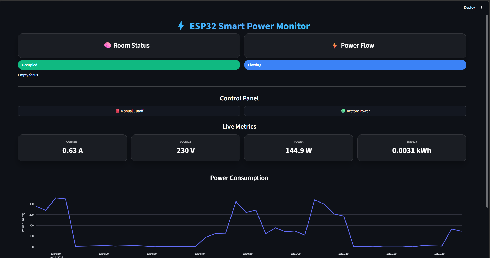
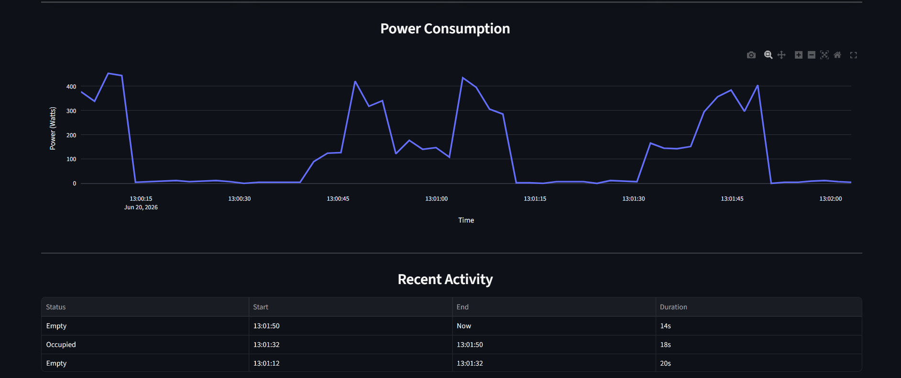
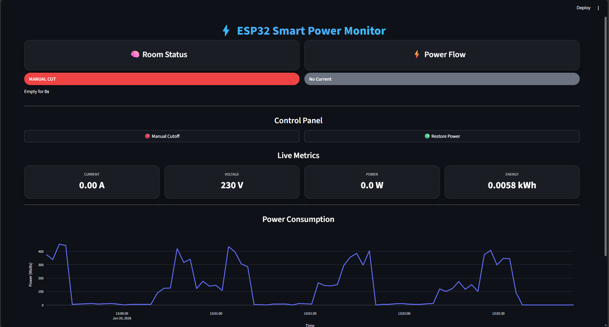
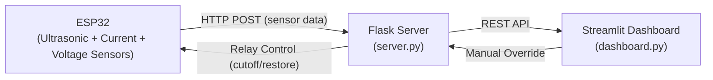
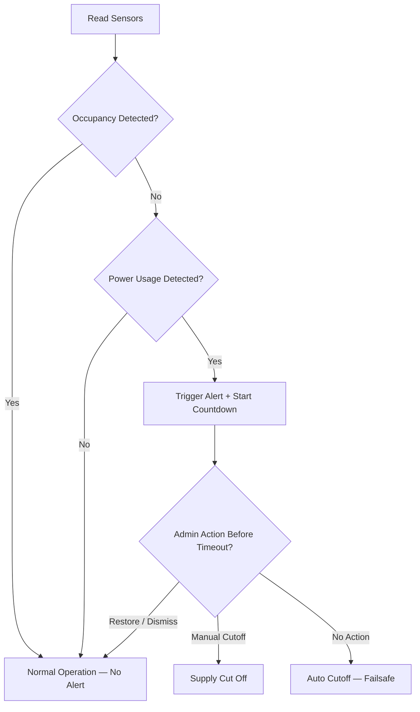

# Smart Electricity Monitoring System using IoT

A real-time IoT-based system to detect **unaccounted electricity usage** in shared spaces like hostels, classrooms, and corridors.

This project combines **ESP32 hardware + Flask backend + Streamlit dashboard** to monitor, analyze, and control power usage intelligently — flagging power draw in rooms that are supposed to be empty, and giving admins a window to act before an automatic failsafe cutoff kicks in.

---

## Table of Contents

- [Features](#features)
- [Dashboard Preview](#dashboard-preview)
- [Architecture](#architecture)
- [Project Structure](#project-structure)
- [Getting Started](#getting-started)
- [System Logic](#system-logic)
- [Dashboard Highlights](#dashboard-highlights)
- [Tech Stack](#tech-stack)
- [Use Cases](#use-cases)
- [Future Improvements](#future-improvements)
- [Authors](#authors)

---

## Features

- 📡 Real-time data from ESP32 (current, voltage + occupancy)
- 📈 Interactive time-series power consumption visualizations using Plotly
- 🧠 Intelligent detection of unoccupied power usage
- ⏳ Countdown-based alert system
- ⚡ Automatic cutoff (failsafe)
- 🔧 Manual override from dashboard
- 📊 Live analytics (current, voltage, power, energy)
- 🎨 Modern UI with near real-time updates

---

## Dashboard Preview

**Normal operation — room occupied, current flowing**
<p align="center">
  
</p>

**Live metrics and power consumption graph**
<p align="center">
  
</p>

**Manual cutoff in action**
<p align="center">
  
</p>

---

## Architecture



The ESP32 streams sensor data to the Flask backend over HTTP, the Streamlit dashboard polls the backend for live state and analytics, and any manual override from the dashboard is relayed back through Flask to trigger the relay on the ESP32.

---

## Project Structure

```
smart-electricity-dashboard-with-iot/
│
├── dashboard.py      # Streamlit UI — live status, Plotly charts, manual controls
├── server.py         # Flask backend API — handles sensor data, state changes, duration logs
├── simulator.py      # Fake data generator (mirrors real relay/cutoff logic, for testing)
├── esp.ino           # ESP32 firmware (hardware)
├── screenshots/      # Dashboard screenshots used in this README
└── README.md
```

---

## Getting Started

### Prerequisites

- Python 3.9+
- Arduino IDE (for flashing the ESP32)
- ESP32 board with ultrasonic, current (SCT-013), and voltage (ZMPT101B) sensors wired up

### 1. Install dependencies

```bash
pip install streamlit flask pandas requests streamlit-autorefresh plotly
```

### 2. Run the backend server

```bash
python server.py
```

### 3. Run the dashboard

```bash
streamlit run dashboard.py
```

### 4. (Optional) Run the simulator

Useful for testing the dashboard without real hardware connected.

```bash
python simulator.py
```

### 5. ESP32 setup

1. Open `esp.ino` in the Arduino IDE and flash it to the ESP32.
2. Update the following before flashing:
   - WiFi SSID and password
   - Flask server IP address

---

## System Logic



- Occupancy is detected using the ultrasonic sensor.
- Current and voltage sensors measure live power usage.
- If a room shows **no occupancy + active power draw**, an alert is raised and a countdown begins on the dashboard.
- During the countdown, an admin can manually cut off or restore supply.
- If no action is taken, the system auto-cuts the supply once the threshold is reached (failsafe).

---

## Dashboard Highlights

- Live status (Occupied / Empty / Cutoff)
- Power flow detection
- Energy consumption metrics with Plotly time-series charts
- Activity logs
- Manual control buttons

---

## Tech Stack

| Category | Components |
|---|---|
| **Hardware** | ESP32, Ultrasonic Sensor (HC-SR04), SCT-013 Current Sensor, ZMPT101B Voltage Sensor, Relay Module |
| **Backend** | Flask (Python) |
| **Frontend** | Streamlit, Plotly |
| **Communication** | HTTP (REST API) |

---

## Use Cases

- Hostels 🏫
- Classrooms 🏫
- Offices 🏢
- Corridors 🚪

---

## Future Improvements

- Mobile app integration
- Cloud deployment
- Smart scheduling
- AI-based anomaly detection

---

## Authors

- **Kavish Goyal**
- **Kaivalya Kumar**
- **Khushi Kumar**

BTech CSE Core, VIT Chennai